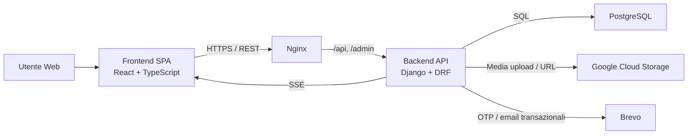

# Design del Sistema

## 1. Obiettivo del documento

Questo documento descrive l'architettura proposta per **BugBoard26** e motiva sia i criteri di design adottati sia le principali scelte tecnologiche implementate nel progetto.  
L'obiettivo del sistema e` fornire una piattaforma collaborativa per la gestione di progetti, issue, assegnazioni, notifiche e allegati, mantenendo un buon equilibrio tra semplicita` di sviluppo, sicurezza, manutenibilita` e supporto a funzionalita` realtime.

## 2. Visione architetturale

L'architettura proposta segue un modello **three-tier**:

1. **Presentation Tier**
   Frontend web SPA sviluppato in React e TypeScript.
2. **Application Tier**
   Backend REST sviluppato in Django e Django REST Framework.
3. **Data Tier**
   Database relazionale PostgreSQL per la persistenza dei dati applicativi.

Accanto ai tre layer principali sono previsti alcuni servizi esterni o infrastrutturali:

- **Nginx** come reverse proxy e web server in produzione.
- **Google Cloud Storage** per la gestione dei file media in ambiente produttivo.
- **Brevo** come provider email per il flusso OTP di reset password.

### 2.1 Diagramma logico

## 3. Criteri di design adottati

### 3.1 Separazione delle responsabilita`

Il sistema e` stato progettato con una separazione netta tra interfaccia utente, logica applicativa e persistenza.  
Questa scelta riduce l'accoppiamento tra i componenti e rende possibile evolvere il frontend, il backend o l'infrastruttura dati con impatto limitato sugli altri layer.

**Motivazione:** per un progetto come BugBoard26, che combina UI ricca, API strutturate e regole di accesso non banali, la separazione dei layer migliora la leggibilita` del sistema e semplifica manutenzione, test e deploy.

### 3.2 Monolite modulare invece di microservizi

Il backend e` organizzato come **monolite modulare**, con moduli distinti per:

- autenticazione
- utenti
- progetti
- issue
- notifiche
- tag

**Motivazione:** il dominio applicativo e` abbastanza ricco da richiedere una suddivisione chiara, ma non abbastanza grande da giustificare la complessita` operativa dei microservizi.  
La soluzione a monolite modulare consente di:

- mantenere un'unica codebase e un unico modello di deploy
- evitare costi di orchestrazione e comunicazione distribuita
- preservare la coerenza transazionale nelle operazioni di dominio
- preparare il codice a future estrazioni di servizi, se necessarie

### 3.3 Domain-driven decomposition leggera

La struttura del backend riflette il dominio applicativo. Le entita` principali sono:

- `Project`
- `Issue`
- `IssueEvent`
- `Attachment`
- `Notification`
- `Tag`
- membership e assegnazioni tra utenti, progetti e issue

**Motivazione:** modellare il codice intorno al dominio rende piu` esplicite le regole di business, facilita la localizzazione della logica e limita la dispersione di responsabilita` tra file e moduli.

### 3.4 Security by design

La sicurezza e` stata trattata come requisito architetturale e non come aggiunta successiva. Le principali scelte sono:

- autenticazione JWT per le API
- refresh token conservato in **cookie HttpOnly**
- protezione **CSRF** per le operazioni mutative
- revoca server-side delle sessioni JWT
- controlli di autorizzazione centralizzati per ruolo e accesso a progetto/issue
- configurazioni di sicurezza HTTP e TLS in produzione

**Motivazione:** BugBoard26 gestisce dati collaborativi, allegati e account utente; era quindi opportuno evitare una soluzione completamente stateless e privilegiare un compromesso piu` sicuro tra ergonomia client e controllo lato server.

### 3.5 Coerenza contrattuale delle API

Le API seguono convenzioni omogenee:

- risorse principali esposte via router DRF
- endpoint di flusso implementati con `APIView`
- naming coerente dei path parameter in camelCase
- documentazione OpenAPI generata automaticamente

**Motivazione:** un contratto API consistente facilita l'integrazione con il frontend, riduce gli errori di utilizzo e migliora la testabilita` del sistema.

### 3.6 Supporto realtime con complessita` controllata

Per notifiche e attivita` sulle issue il sistema adotta **Server-Sent Events (SSE)** invece di WebSocket.

**Motivazione:** il dominio richiede un flusso realtime prevalentemente unidirezionale, dal server al client. SSE permette di ottenere aggiornamenti in tempo reale con una soluzione piu` semplice da implementare, osservare e mantenere rispetto a un canale bidirezionale completo.

### 3.7 Progettazione orientata alla manutenibilita`

Nel frontend la struttura per feature separa:

- API layer
- model/types
- UI components
- flow applicativi
- pagine
- componenti condivisi

Nel backend la logica e` distribuita in moduli, serializer, query helper, permission helper e comandi di dominio.

**Motivazione:** questa organizzazione riduce il rischio di file monolitici, favorisce il riuso e rende piu` semplice per piu` sviluppatori lavorare sul progetto in parallelo.

## 4. Descrizione dell'architettura proposta

### 4.1 Layer di presentazione

Il frontend e` una **Single Page Application** realizzata con React.  
Le sue responsabilita` principali sono:

- autenticazione dell'utente e gestione dello stato sessione
- navigazione tra progetti, issue e impostazioni
- invocazione delle API REST
- aggiornamento della UI con caching e invalidazione dati
- ascolto degli stream realtime di notifiche e attivita`

Il layer frontend non contiene logica di persistenza e delega al backend le regole di business e autorizzazione.

**Motivazione architetturale:** mantenere il frontend focalizzato su esperienza utente, composizione delle schermate e sincronizzazione con le API migliora la coerenza del sistema ed evita duplicazioni delle regole applicative.

### 4.2 Layer applicativo

Il backend Django espone il perimetro funzionale del sistema tramite API REST e gestisce:

- autenticazione e refresh dei token
- autorizzazione per ruoli e membership
- CRUD di utenti, progetti, issue e tag
- storico eventi sulle issue
- notifiche applicative
- upload e validazione degli allegati
- generazione della documentazione OpenAPI

La componente applicativa adotta una logica di accesso centralizzata:

- gli **admin** hanno visibilita` globale
- gli utenti **developer** accedono ai soli progetti di cui fanno parte
- le modifiche alle issue sono limitate ad admin o assegnatari

**Motivazione architetturale:** il backend diventa il punto unico di enforcement delle regole, garantendo consistenza anche quando il frontend evolve o quando si introducono nuovi client.

### 4.3 Layer dati

Il database PostgreSQL gestisce in modo relazionale:

- utenti e ruoli
- progetti e membership
- issue, tag e assegnazioni
- eventi delle issue
- notifiche e stato di lettura
- riferimenti agli allegati

La modellazione relazionale e` particolarmente adatta perche' il dominio contiene molte relazioni consistenti e navigabili, ad esempio:

- molti-a-molti tra progetti e utenti
- molti-a-molti tra issue e assegnatari
- molti-a-molti tra notification e destinatari
- relazioni padre-figlio tra issue, eventi e attachment

**Motivazione architetturale:** la natura strutturata del dominio rende PostgreSQL una scelta piu` naturale e robusta rispetto a database NoSQL.

### 4.4 Realtime e sincronizzazione

Le notifiche e gli aggiornamenti delle issue usano endpoint SSE dedicati. Il frontend mantiene la cache applicativa sincronizzata attraverso React Query e, quando necessario, idrata entita` aggiornate rileggendo il dato dal backend.

Questa soluzione consente di:

- mostrare nuove notifiche in tempo reale
- aggiornare la timeline delle issue senza refresh manuale
- mantenere il client coerente con la fonte autorevole dei dati

**Motivazione architetturale:** si ottiene una UX moderna e reattiva senza introdurre l'onere infrastrutturale di broker realtime o WebSocket full-duplex.

### 4.5 Vista di deployment

#### Sviluppo

In sviluppo i componenti sono orchestrati tramite Docker Compose:

- `frontend` eseguito con Vite Dev Server
- `backend` eseguito in container Django
- `db` PostgreSQL
- `nginx` opzionale tramite profilo dedicato

#### Produzione

In produzione l'architettura adotta:

- immagini **immutable** per backend e web
- `web` Nginx come entry point unico sulle porte 80/443
- `backend` e `db` esposti solo sulla rete Docker interna
- TLS terminato su Nginx
- file statici serviti da Nginx
- media conservati su Google Cloud Storage

**Motivazione architetturale:** la separazione tra sviluppo e produzione permette di ottimizzare l'esperienza degli sviluppatori senza compromettere robustezza, sicurezza e ripetibilita` del deploy reale.

### 4.6 Principali trade-off

L'architettura scelta presenta anche alcuni compromessi consapevoli:

- il monolite modulare scala meno finemente dei microservizi, ma semplifica molto l'operativita`
- l'uso di cache in memoria e un singolo worker Gunicorn per SSE privilegia affidabilita` del deployment single-VM rispetto alla scalabilita` orizzontale
- SSE copre molto bene il realtime unidirezionale, ma non e` la scelta ideale per scenari collaborativi bidirezionali ad alta frequenza

Questi trade-off sono coerenti con il perimetro attuale del progetto.

## 5. Scelte tecnologiche adottate e motivazioni

### 5.1 Frontend

#### React 19

React e` stato scelto per realizzare una SPA component-based, adatta a un'interfaccia ricca e dinamica come quella di BugBoard26.

**Motivazioni principali:**

- ecosistema maturo
- forte riusabilita` dei componenti
- buona integrazione con librerie di routing, caching e testing
- adatto a schermate interattive con stato locale e remoto

#### TypeScript

TypeScript aumenta l'affidabilita` del frontend tramite tipizzazione statica.

**Motivazioni principali:**

- riduzione degli errori di integrazione con le API
- migliore documentazione implicita dei contratti dati
- supporto al refactoring sicuro in una codebase medio-grande

#### Vite

Vite e` usato come tool di sviluppo e build.

**Motivazioni principali:**

- avvio rapido del progetto
- hot reload efficiente
- semplicita` di configurazione
- ottimo supporto per React e TypeScript

#### React Router

Gestisce la navigazione applicativa tra login, progetti, issue e impostazioni.

**Motivazioni principali:**

- routing dichiarativo
- protezione delle rotte pubbliche e private
- integrazione naturale con una SPA

#### TanStack React Query

E` la scelta per la gestione dello stato server-side nel frontend.

**Motivazioni principali:**

- caching delle chiamate REST
- invalidazione semplice e controllata
- sincronizzazione naturale con eventi realtime
- riduzione della logica manuale di fetch e loading state

#### Axios

Axios e` usato come client HTTP condiviso.

**Motivazioni principali:**

- interceptors per token, refresh e CSRF
- configurazione centralizzata delle richieste
- gestione uniforme di timeout e retry applicativi

#### Tailwind CSS

Tailwind e` adottato per la stilizzazione del frontend.

**Motivazioni principali:**

- velocita` di sviluppo UI
- consistenza stilistica
- riduzione del CSS custom disperso
- buon compromesso tra produttivita` e controllo visuale

### 5.2 Backend

#### Django 5

Django costituisce il framework principale del backend.

**Motivazioni principali:**

- framework stabile e maturo
- ORM robusto per un dominio fortemente relazionale
- strumenti built-in per admin, security e gestione configurazioni
- buona produttivita` nello sviluppo di applicazioni business-oriented

#### Django REST Framework

DRF e` usato per esporre il backend come API REST.

**Motivazioni principali:**

- serializer e validation layer ben strutturati
- viewset e mixin per endpoint standard
- ottima integrazione con permessi e autenticazione
- facilita` di documentazione e test

#### SimpleJWT

Gestisce autenticazione JWT e refresh token.

**Motivazioni principali:**

- integrazione consolidata con DRF
- supporto alla rotazione dei refresh token
- compatibilita` con una strategia ibrida token + cookie HttpOnly

#### drf-spectacular

Genera schema OpenAPI e documentazione navigabile.

**Motivazioni principali:**

- documentazione API sempre allineata al codice
- supporto a Swagger UI e Redoc
- utile per integrazione, testing e manutenzione

#### django-cors-headers

Gestisce in modo esplicito le policy CORS.

**Motivazioni principali:**

- configurazione chiara tra ambienti
- maggiore controllo sulla superficie esposta

#### Gunicorn

Usato come application server WSGI in produzione.

**Motivazioni principali:**

- deployment stabile e collaudato per Django
- configurazione semplice
- buon allineamento con una topologia single-VM

### 5.3 Persistenza e servizi esterni

#### PostgreSQL 16

E` il database principale del sistema.

**Motivazioni principali:**

- affidabilita` e maturita`
- ottimo supporto a vincoli, relazioni e query articolate
- perfetta integrazione con Django ORM

#### Google Cloud Storage

Usato in produzione per avatar e allegati.

**Motivazioni principali:**

- separazione tra storage applicativo e filesystem locale del container
- maggiore resilienza nel deploy
- URL media diretti e indipendenti da Nginx

#### Brevo tramite django-anymail

Usato per l'invio di email transazionali e OTP.

**Motivazioni principali:**

- astrazione pulita del provider email
- integrazione semplice con Django
- facilita` di estensione verso ambienti reali

### 5.4 Infrastruttura e delivery

#### Docker e Docker Compose

Sono usati per standardizzare ambienti locali, CI e produzione.

**Motivazioni principali:**

- riproducibilita` dell'esecuzione
- riduzione dei problemi di configurazione locale
- semplificazione dell'onboarding
- chiarezza nella definizione dello stack

#### Nginx

In produzione Nginx svolge il ruolo di reverse proxy e static server.

**Motivazioni principali:**

- terminazione TLS
- instradamento delle richieste verso backend e admin
- erogazione efficiente degli asset statici
- gestione esplicita degli header di sicurezza
- supporto adeguato agli stream SSE tramite configurazione dedicata

#### Immagini immutable

Il deploy produttivo usa immagini buildate in CI e distribuite alla VM.

**Motivazioni principali:**

- allineamento tra artefatto testato e artefatto rilasciato
- minore rischio di drift ambientale
- deploy piu` prevedibile e auditabile

### 5.5 Testing e qualita`

Il progetto adotta una strategia di qualita` multilivello:

- test backend Django
- test frontend con Vitest e Testing Library
- collezioni Bruno per test API
- schema OpenAPI come supporto alla validazione contrattuale

**Motivazione:** la combinazione di test di dominio, test UI e test di integrazione API riduce il rischio di regressioni sui flussi principali.

## 6. Conclusioni

L'architettura proposta per BugBoard26 privilegia una soluzione **semplice ma solida**: un monolite modulare su architettura three-tier, con frontend SPA, backend REST, database relazionale e integrazioni mirate per media, email e realtime.

Le scelte progettuali adottate risultano coerenti con gli obiettivi del sistema:

- mantenere il progetto facilmente evolvibile
- garantire una buona separazione delle responsabilita`
- supportare sicurezza e controlli di accesso in modo centralizzato
- offrire una user experience moderna con aggiornamenti realtime
- contenere la complessita` operativa rispetto al perimetro reale dell'applicazione

Nel complesso, il sistema rappresenta una base architetturale adeguata sia per il rilascio corrente sia per future estensioni incrementali.
