# Diagramma delle classi del backend

Questo diagramma segue l'impostazione della sezione *Class Diagram* del PDF `05-A-UML Recap.pdf`: classi con attributi/operazioni essenziali, generalizzazioni e associazioni tra elementi del backend.

Scelte di modellazione:
- sono incluse le classi di dominio e di supporto applicativo del backend Django/DRF: `models`, `serializers`, `services`, `APIView`/`ViewSet`, autenticazione OpenAPI;
- i tipi framework esterni (`Model`, `Serializer`, `APIView`, `GenericViewSet`, `User`, ...) sono modellati come supertipi esterni per rendere leggibile l'ereditarieta`;
- la function-based view `health_check` non compare, perche' non e' una classe.

```mermaid
classDiagram
direction LR

class DjangoModel {
  <<framework>>
}
class DRFModelSerializer {
  <<framework>>
}
class DRFSerializer {
  <<framework>>
}
class APIView {
  <<framework>>
}
class GenericViewSet {
  <<framework>>
}
class PageNumberPagination {
  <<framework>>
}
class OpenApiAuthenticationExtension {
  <<framework>>
}
class DjangoUser {
  <<external>>
  +id: int
  +username: str
  +email: str
}

namespace api {
  class RevocableJWTAuthenticationScheme {
    +target_class: str
    +name: str
    +get_security_definition(auto_schema)
  }
  class CSRFAwareSessionAuthenticationScheme {
    +target_class: str
    +name: str
    +get_security_definition(auto_schema)
  }
}

namespace users {
  class UserProfileImage {
    +user: DjangoUser
    +profile_img: str
    +__str__() str
  }
  class PasswordResetOTP {
    +otp_id: int
    +user: DjangoUser
    +code: str
    +created_at: datetime
    +expires_at: datetime
    +is_used: bool
    +attempt_count: int
    +hash_code(raw_code) str
    +set_code(raw_code) void
    +matches_code(raw_code) bool
    +is_valid() bool
  }
  class RevokedTokenSession {
    +sid: str
    +user: DjangoUser
    +expires_at: datetime
    +revoked_at: datetime
    +is_active() bool
  }

  class UserReadSerializer {
    +get_group(instance) str
    +get_isAdmin(instance) bool
    +get_profileImg(instance) str
  }
  class UserMutationSerializer {
    +validate_email(value) str
    +validate_username(value) str
    +validate(attrs) dict
    +create(validated_data) DjangoUser
    +update(instance, validated_data) DjangoUser
  }
  class UserSerializer
  class ChangePasswordSerializer
  class AdminResetPasswordSerializer

  class UserListPagination {
    +page_size: int
    +page_query_param: str
    +max_page_size: int
  }
  class UserViewSet {
    +get_serializer_class()
    +get_queryset()
    +create(request)
    +partial_update(request)
  }
  class CurrentUserPasswordView {
    +put(request)
  }
  class UserPasswordView {
    +put(request, userId)
  }
  class CurrentUserProfileImageView {
    +put(request)
  }
  class UserProfileImageView {
    +put(request, userId)
  }

  class UserService {
    +filter_queryset(queryset, actor, filters)
    +change_current_user_password(actor, payload) dict
    +reset_user_password(actor, target_user_id, payload) dict
    +save_profile_image(request, user)
    +create_from_validated_data(validated_data) DjangoUser
    +update_from_validated_data(instance, validated_data) DjangoUser
  }
}

namespace auth {
  class PasswordOTPRequestSerializer
  class PasswordOTPVerifySerializer
  class PasswordResetSerializer
  class CSRFTokenResponseSerializer
  class LoginRequestSerializer
  class LoginResponseSerializer
  class RefreshResponseSerializer
  class DetailResponseSerializer
  class PasswordOTPVerifyResponseSerializer

  class CSRFTokenView {
    +get(request)
  }
  class LoginView {
    +handle_exception(exc)
    +post(request)
  }
  class RefreshView {
    +post(request)
  }
  class LogoutView {
    +delete(request)
  }
  class MeView {
    +get(request)
  }
  class PasswordOTPRequestView {
    +post(request)
  }
  class PasswordOTPVerifyView {
    +post(request)
  }
  class PasswordResetView {
    +post(request)
  }
}

namespace projects {
  class Project {
    +project_id: int
    +name: str
    +created_at: datetime
    +description: str
    +color: str
    +icon: str
    +created_by: DjangoUser
    +__str__() str
  }
  class ProjectMembership {
    +project_membership_id: int
    +project: Project
    +user: DjangoUser
  }
  class ProjectMembershipSerializer {
    +get_role(instance) str
    +to_representation(instance) dict
  }
  class ProjectSerializer {
    +to_representation(instance) dict
  }
  class ProjectNotificationHooks {
    +project_assigned: Callable
    +project_removed: Callable
    +project_unassigned: Callable
  }
  class ProjectService {
    +create_project_memberships(project, creator, raw_user_ids)
    +sync_project_team_members(project, raw_user_ids, actor)
    +create_project_with_team(serializer, creator, raw_user_ids)
    +update_project_with_team(serializer, project, raw_user_ids, actor)
    +delete_project_and_notify(project, actor)
  }
  class ProjectViewSet {
    +get_queryset()
    +perform_create(serializer)
    +partial_update(request)
    +destroy(request)
    +members(request)
    +subscription(request)
  }
}

namespace tags {
  class Tag {
    +tag_id: int
    +name: str
    +normalize_name(name) str
    +find_by_normalized_name(name) Tag
    +get_or_create_normalized(name) tuple
    +save()
  }
  class TagSerializer {
    +validate_name(value) str
    +create(validated_data) Tag
  }
}

namespace issues {
  class IssueType {
    <<enumeration>>
  }
  class IssueStatus {
    <<enumeration>>
  }
  class Priority {
    <<enumeration>>
  }
  class EventType {
    <<enumeration>>
  }

  class Issue {
    +issue_id: int
    +project: Project
    +reporter: DjangoUser
    +title: str
    +description: str
    +issue_type: str
    +status: str
    +priority: str
    +created_at: datetime
    +__str__() str
  }
  class IssueAssignee {
    +issue_assignee_id: int
    +issue: Issue
    +user: DjangoUser
  }
  class IssueTag {
    +issue_tag_id: int
    +issue: Issue
    +tag: Tag
  }
  class IssueEvent {
    +update_id: int
    +issue: Issue
    +actor: DjangoUser
    +event_type: str
    +at: datetime
    +message: str
    +old_status: str
    +new_status: str
  }
  class Attachment {
    +attachment_id: int
    +update: IssueEvent
    +original_name: str
    +path: str
    +mime_type: str
    +size: int
    +uploaded_at: datetime
  }

  class IssueSerializer {
    +get_assignees(obj) list
    +validate(attrs) dict
    +create(validated_data) Issue
    +update(instance, validated_data) Issue
  }
  class AttachmentSerializer {
    +get_url(obj) str
  }
  class IssueEventSerializer {
    +get_attachments(obj) list
  }
  class IssueSuggestionSerializer

  class IssueNotificationHooks {
    +issue_added: Callable
    +issue_updated: Callable
    +issue_assigned: Callable
    +issue_unassigned: Callable
    +issue_closed: Callable
  }
  class IssueSideEffectPlan {
    +event_type: str
    +message: str
    +event_fields: dict
    +payload: dict
    +notification_sender: Callable
    +notification_users: list
  }
  class IssueWorkflow {
    +ensure_valid_status(requested_status) void
    +plan_issue_update(actor, old_status, requested_status, raw_message, notifications) IssueSideEffectPlan
  }
  class IssueService {
    +create_from_validated_data(validated_data) Issue
    +update_from_validated_data(instance, validated_data) Issue
    +validate_project_assignee_ids(project, assignee_ids) void
    +validate_issue_assignment_user_ids(project, user_ids) void
    +create_issue_for_project(serializer, reporter, project) Issue
    +update_issue_from_serializer(serializer, actor, raw_message) Issue
    +assign_issue_users(issue, actor, raw_user_ids) void
    +unassign_issue_users(issue, actor, raw_user_ids) void
    +create_issue_comment(issue, actor, raw_message, payload) IssueEvent
  }

  class ProjectIssueListCreateView {
    +get(request, projectId)
    +post(request, projectId)
  }
  class IssueViewSet {
    +get_queryset()
    +perform_update(serializer)
    +subscription(request)
    +events(request)
    +events_stream(request)
    +suggestions(request)
    +partial_update(request)
  }
  class IssueAssigneeDetailView {
    +put(request, issueId, userId)
    +delete(request, issueId, userId)
  }
}

namespace notifications {
  class NotifyType {
    <<enumeration>>
  }
  class Notification {
    +notification_id: int
    +notify_type: str
    +issue: Issue
    +project: Project
    +created_at: datetime
  }
  class NotifyUser {
    +notify_user_id: int
    +notification: Notification
    +user: DjangoUser
    +is_read: bool
    +read_at: datetime
  }
  class NotifyUserSerializer {
    +get_issueId(obj) int
    +get_projectId(obj) int
  }
  class NotificationsPageSerializer
  class NotificationReadAllResponseSerializer
  class NotificationPatchSerializer {
    +validate_isRead(value) bool
  }
  class NotificationService {
    +create(notify_type, users, actor, issue, project) Notification
    +publish_created_notifications(notify_users_rows) void
    +mark_as_read(notify_user) NotifyUser
    +mark_all_as_read(user) int
    +delete_for_user(notify_user) void
    +list_page(user, limit, before) dict
    +load_catchup_notifications(user_id, last_seen_id) list
    +serialize_stream_item(notify_user) tuple
  }
  class NotificationViewSet {
    +get_renderers()
    +get_queryset()
    +list(request)
    +partial_update(request)
    +destroy(request)
    +stream(request)
  }
}

UserProfileImage --|> DjangoModel
PasswordResetOTP --|> DjangoModel
RevokedTokenSession --|> DjangoModel
Project --|> DjangoModel
ProjectMembership --|> DjangoModel
Tag --|> DjangoModel
Issue --|> DjangoModel
IssueAssignee --|> DjangoModel
IssueTag --|> DjangoModel
IssueEvent --|> DjangoModel
Attachment --|> DjangoModel
Notification --|> DjangoModel
NotifyUser --|> DjangoModel

UserReadSerializer --|> DRFModelSerializer
UserMutationSerializer --|> UserReadSerializer
UserSerializer --|> UserReadSerializer
ChangePasswordSerializer --|> DRFSerializer
AdminResetPasswordSerializer --|> DRFSerializer
PasswordOTPRequestSerializer --|> DRFSerializer
PasswordOTPVerifySerializer --|> DRFSerializer
PasswordResetSerializer --|> DRFSerializer
CSRFTokenResponseSerializer --|> DRFSerializer
LoginRequestSerializer --|> DRFSerializer
LoginResponseSerializer --|> DRFSerializer
RefreshResponseSerializer --|> DRFSerializer
DetailResponseSerializer --|> DRFSerializer
PasswordOTPVerifyResponseSerializer --|> DRFSerializer
ProjectMembershipSerializer --|> DRFModelSerializer
ProjectSerializer --|> DRFModelSerializer
TagSerializer --|> DRFModelSerializer
IssueSerializer --|> DRFModelSerializer
AttachmentSerializer --|> DRFModelSerializer
IssueEventSerializer --|> DRFModelSerializer
IssueSuggestionSerializer --|> ProjectMembershipSerializer
NotifyUserSerializer --|> DRFModelSerializer
NotificationsPageSerializer --|> DRFSerializer
NotificationReadAllResponseSerializer --|> DRFSerializer
NotificationPatchSerializer --|> DRFSerializer

UserListPagination --|> PageNumberPagination
UserViewSet --|> GenericViewSet
ProjectViewSet --|> GenericViewSet
IssueViewSet --|> GenericViewSet
NotificationViewSet --|> GenericViewSet
CSRFTokenView --|> APIView
LoginView --|> APIView
RefreshView --|> APIView
LogoutView --|> APIView
MeView --|> APIView
PasswordOTPRequestView --|> APIView
PasswordOTPVerifyView --|> APIView
PasswordResetView --|> APIView
CurrentUserPasswordView --|> APIView
UserPasswordView --|> APIView
CurrentUserProfileImageView --|> APIView
UserProfileImageView --|> APIView
ProjectIssueListCreateView --|> APIView
IssueAssigneeDetailView --|> APIView
RevocableJWTAuthenticationScheme --|> OpenApiAuthenticationExtension
CSRFAwareSessionAuthenticationScheme --|> OpenApiAuthenticationExtension

DjangoUser "1" --> "0..1" UserProfileImage : profile
DjangoUser "1" --> "0..*" PasswordResetOTP : otp_codes
DjangoUser "1" --> "0..*" RevokedTokenSession : revoked_sessions
DjangoUser "1" --> "0..*" ProjectMembership : project_memberships
DjangoUser "1" --> "0..*" Project : created_projects
DjangoUser "1" --> "0..*" Issue : reported_issues
DjangoUser "1" --> "0..*" IssueAssignee : issue_assignments
DjangoUser "1" --> "0..*" IssueEvent : issue_events
DjangoUser "1" --> "0..*" NotifyUser : notifications

Project "1" --> "0..*" ProjectMembership : memberships
Project "1" --> "0..*" Issue : issues
Project "1" --> "0..*" Notification : notifications
Issue "1" --> "0..*" IssueAssignee : assignees
Issue "1" --> "0..*" IssueTag : tags
Issue "1" --> "0..*" IssueEvent : events
Issue "1" --> "0..*" Notification : notifications
Tag "1" --> "0..*" IssueTag : tagged_in
IssueEvent "1" --> "0..*" Attachment : attachments
Notification "1" --> "0..*" NotifyUser : recipients

ProjectMembershipSerializer --> ProjectMembership : serializes
ProjectSerializer --> Project : serializes
TagSerializer --> Tag : serializes
IssueSerializer --> Issue : serializes
AttachmentSerializer --> Attachment : serializes
IssueEventSerializer --> IssueEvent : serializes
NotifyUserSerializer --> NotifyUser : serializes
UserReadSerializer --> DjangoUser : serializes
UserMutationSerializer --> UserService : delegates
IssueSerializer --> IssueService : delegates

UserService --> UserProfileImage : manages
ProjectService --> Project : manages
ProjectService --> ProjectMembership : manages
ProjectService --> ProjectNotificationHooks : uses
IssueWorkflow --> IssueSideEffectPlan : creates
IssueWorkflow --> IssueNotificationHooks : uses
IssueService --> IssueWorkflow : orchestrates
IssueService --> Issue : manages
IssueService --> IssueAssignee : manages
IssueService --> IssueTag : manages
IssueService --> IssueEvent : produces
IssueService --> IssueNotificationHooks : uses
NotificationService --> Notification : manages
NotificationService --> NotifyUser : manages

UserViewSet --> UserSerializer : reads
UserViewSet --> UserMutationSerializer : writes
UserViewSet --> UserService : uses
CurrentUserPasswordView --> ChangePasswordSerializer : validates
CurrentUserPasswordView --> UserService : uses
UserPasswordView --> AdminResetPasswordSerializer : validates
UserPasswordView --> UserService : uses
CurrentUserProfileImageView --> UserService : uses
UserProfileImageView --> UserService : uses

LoginView --> LoginRequestSerializer : validates
LoginView --> LoginResponseSerializer : returns
LoginView --> UserReadSerializer : returns_user
RefreshView --> RefreshResponseSerializer : returns
LogoutView --> DetailResponseSerializer : documents
MeView --> UserReadSerializer : returns
PasswordOTPRequestView --> PasswordOTPRequestSerializer : validates
PasswordOTPVerifyView --> PasswordOTPVerifySerializer : validates
PasswordOTPVerifyView --> PasswordOTPVerifyResponseSerializer : returns
PasswordResetView --> PasswordResetSerializer : validates

ProjectViewSet --> ProjectSerializer : uses
ProjectViewSet --> ProjectMembershipSerializer : members_response
ProjectViewSet --> ProjectService : uses
ProjectIssueListCreateView --> IssueSerializer : uses
ProjectIssueListCreateView --> IssueService : uses
IssueViewSet --> IssueSerializer : uses
IssueViewSet --> IssueEventSerializer : uses
IssueViewSet --> IssueSuggestionSerializer : uses
IssueViewSet --> IssueService : uses
IssueAssigneeDetailView --> IssueService : uses
NotificationViewSet --> NotifyUserSerializer : uses
NotificationViewSet --> NotificationPatchSerializer : validates
NotificationViewSet --> NotificationsPageSerializer : returns_page
NotificationViewSet --> NotificationService : uses
```

## Note utili per la relazione

- `Project`, `Issue`, `Notification` e `DjangoUser` formano il nucleo del dominio.
- I `Serializer` mappano i modelli verso il contratto REST e, in alcuni casi (`UserMutationSerializer`, `IssueSerializer`), delegano parte della logica ai `Service`.
- I `Service` concentrano la logica applicativa e le side effect: gestione membership, aggiornamento issue, notifiche, upload immagini.
- Le `View`/`ViewSet` restano sottili: orchestrano permessi, validazione e delega a serializer/service.
- `NotificationService` e `IssueService` sono i punti dove il dominio si collega agli eventi realtime e alle notifiche.
